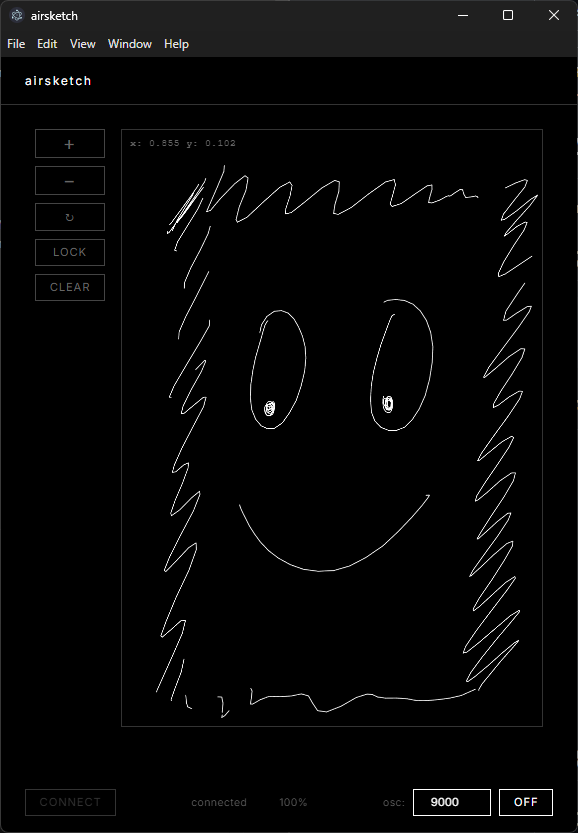

# AirSketch

Smart pen application for NeoLab smart pens with real-time drawing visualization and OSC output.



## Setup

```bash
npm install
npm start
```

## Features

- **Bluetooth Connectivity**: Connects to NeoLab smart pens (e.g., LAMY safari) via Web Bluetooth
- **Real-time Drawing**: Captures and renders handwritten strokes in real-time on canvas
- **Canvas Controls**:
  - Zoom in/out (buttons or mouse wheel)
  - Pan (click and drag)
  - Rotate (90° increments)
  - Lock/unlock bounds
  - Clear canvas
- **OSC Output**: Broadcasts pen coordinates to external applications (e.g., TouchDesigner, Max/MSP)
- **Fixed Coordinate Mapping**: Accurately maps pen input area (x: 0.01-0.7, y: 0.36-0.95) to canvas

## Recent Changes

### Coordinate Scaling Fix
- Fixed paper bounds to match actual pen coordinate range:
  - **X range**: 0.01 to 0.7 (width: 0.69)
  - **Y range**: 0.36 to 0.95 (height: 0.59)
- Improved scaling accuracy for consistent drawing alignment
- Updated Clear button to reset to fixed bounds instead of zeroing out

## OSC Server

### Configuration
- **Default Address**: `127.0.0.1` (localhost)
- **Default Port**: `9000`
- **Toggle**: Use the OSC toggle button in the UI to enable/disable output
- **Port Change**: Modify the port number in the UI (valid range: 1024-65535)

### Message Format
Messages are sent on the `/pen` address with the following format:
- **Argument 1** (float): Normalized X coordinate (0.0 to 1.0)
- **Argument 2** (float): Normalized Y coordinate (0.0 to 1.0)
- **Argument 3** (int): Pen state
  - `0` = Pen down (stroke start)
  - `1` = Pen move (drawing)
  - `2` = Pen up (stroke end)

### Example Use Cases
- **TouchDesigner**: Receive pen data to control visual parameters
- **Max/MSP**: Use pen gestures for audio/visual synthesis
- **Processing**: Create interactive drawings based on pen input
- **Any OSC-compatible software**: Map pen coordinates to any parameter

### Testing OSC Output
You can test the OSC output using tools like:
- **OSCulator** (macOS)
- **OSC Monitor** (cross-platform)
- **TouchDesigner** with OSC In CHOP
- **Max/MSP** with udpreceive object

## Technical Details

Built with:
- **Electron** 40.0.0
- **web_pen_sdk** 0.8.0
- **osc** 2.4.5

Canvas resolution: 592×840 (A5 portrait aspect ratio, 2× scale for Retina/HighDPI displays)
